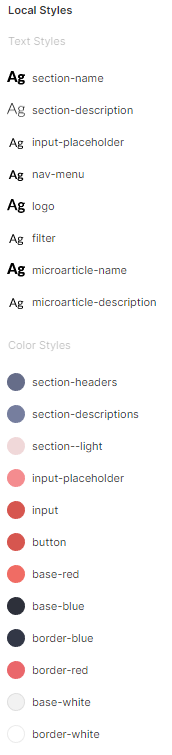

# Singolo (Figma version)
This is Singolo mockup made in Figma

## Advantages

### Fast export

All necessary images are exported in the required formats:

### Color and text styles

Here the main colors and text styles have their own name:

### Rulers, grids and other Figma benefits

Due to the Figma convenience, it turned out to make the layout very accurate:

## It looks like this...

