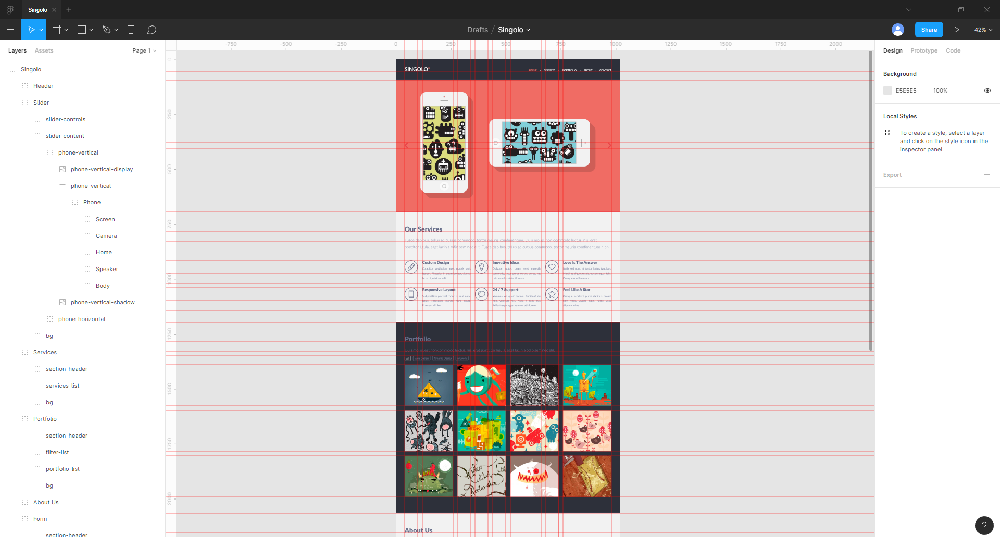

# singolo-figma
This is Singolo mockup made in Figma

## Advantages

### Fast export

All necessary images are exported in the required formats:

### Rulers and other Figma benefits

## Full image

